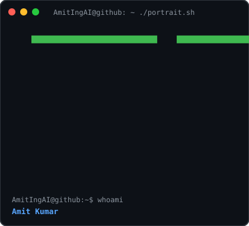
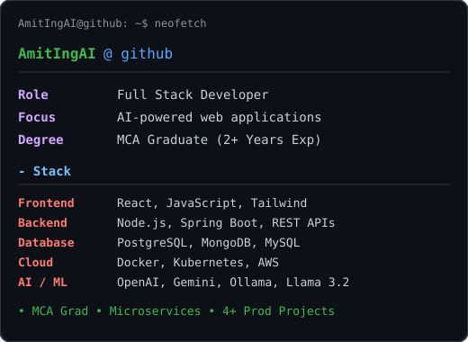

  

<table>
  <tr>
    <td valign="center"></td>
    <td valign="top"></td>
  </tr>
</table>

<!-- HERO SECTION -->

  <h3><strong>Full Stack & Backend Engineer | AI & Data Science Enthusiast</strong></h3>
  
<i>Building scalable applications, AI-powered solutions, backend systems, and modern web applications.</i>

  

    
    
    
    
  

  
  

 

<!-- ABOUT ME -->
<h2 align="center">🚀 About Me</h2>

<table width="100%" border="0">
<tr>
<td width="40%" valign="top">

### 👨‍💻 Who am I?

* 🎓 **MCA Graduate** with 2+ years of experience in full-stack development
* 💻 **Full Stack & Backend Developer** passionate about building scalable applications and AI-powered solutions
* 🚀 Currently building production-ready software using modern backend technologies and cloud infrastructure
* 🌱 Currently learning **System Design, AWS, Kubernetes, AI Agents, LLM Engineering, and High Performance Backend Systems**
* 📹 Passionate about high-performance apps and AI-assisted tooling

<blockquote>
  <i>"I don't just write code. I build scalable solutions that solve real-world problems."</i>
</blockquote>

</td>
<td width="60%" align="center" valign="middle">

</td>
</tr>
</table>

---

### 🏅 Achievements

- 🏆 **MCA Graduate** — Software Engineering & Web Architecture
- 💻 **2+ Years Experience** — Production-Grade Full Stack Applications
- 👨‍💼 **Lead Developer** — MediBook-Pro Healthcare Platform
- 💳 **Architect** — Bankify Digital Banking System
- 🍕 **Builder** — FoodDelivery MERN Platform
- 🛒 **Developer** — ShopSmart E-Commerce

---

## ⚡ Tech Stack & Engineering Arsenal

<table width="100%" align="center">
  <tr>
    <td width="50%" valign="top">
      <h3>💻 Languages</h3>
      
        
      <h3>🎨 Frontend</h3>
      
        
      <h3>⚙️ Backend</h3>
      
        
      <h3>🗄️ Databases & Caching</h3>
      
        
      <h3>☁️ Cloud & DevOps</h3>
      
    </td>
    <td width="50%" valign="top">
      <h3>🤖 Artificial Intelligence</h3>
      

        
        
         Ollama • Llama 3.2 • Prompt Engineering • NLP • Deep Learning • Fine-Tuning • Structured Output • AI Agents • Intent Classification • AI Chatbots
      

       
      <h3>🔐 Security & Access Control</h3>
      
JWT • RSA Encryption • PKI Authentication • Role Based Access Control (RBAC) • OAuth • Authentication • Authorization

       
      <h3>🌐 Architecture</h3>
      
REST APIs • Microservices • System Design • CI/CD • Docker Sidecar Pattern

    </td>
  </tr>
</table>

---

## 💼 Featured Projects

<table width="100%">
  <tr>
    <td width="50%" valign="top">
      <h3>🏥 MediBook-Pro</h3>
      
A comprehensive healthcare management system for patient records, appointments, and medical workflows.

      
<code>React</code> <code>Node.js</code> <code>MongoDB</code> <code>REST APIs</code>

      <ul>
        <li>✔ Dynamic Appointment Scheduling & Real-time Availability</li>
        <li>✔ Patient History Management & Role-Based Access</li>
      </ul>
    </td>
    <td width="50%" valign="top">
      <h3>💳 Bankify Digital Banking</h3>
      
Full-stack digital banking with accounts, transactions, loans, and investments.

      
<code>React</code> <code>Node.js</code> <code>Express</code> <code>MongoDB</code> <code>JWT</code>

      <ul>
        <li>✔ Secure Fund Transfers & Multi-Account Management</li>
        <li>✔ Enterprise JWT Auth & Financial Dashboard</li>
      </ul>
    </td>
  </tr>
  <tr>
    <td width="50%" valign="top">
      <h3>🍕 FoodDelivery MERN Platform</h3>
      
Food delivery app with real-time tracking and multi-role dashboards.

      
<code>MERN</code> <code>Redux</code> <code>Tailwind</code>

      <ul>
        <li>✔ Customer / Restaurant / Delivery Partner roles</li>
        <li>✔ Live Order Status & Production UI/UX</li>
      </ul>
    </td>
    <td width="50%" valign="top">
      <h3>🛒 ShopSmart E-Commerce</h3>
      
Premium e-commerce platform with cart, wishlist, and auth.

      
<code>React.js</code> <code>JavaScript</code> <code>Context API</code>

      <ul>
        <li>✔ Search, Filter & Persistent Cart</li>
        <li>✔ Clean Dashboard & Seamless Checkout</li>
      </ul>
    </td>
  </tr>
</table>

---

## 🚀 Engineering Experience

Throughout my software engineering journey, I have designed and implemented production-ready systems across multiple domains.

<table width="100%">
  <tr>
    <td width="33%" valign="top">
      <h3>🌐 Backend Systems</h3>
      <ul>
        <li>REST APIs</li>
        <li>Authentication & Authorization</li>
        <li>Payment Gateways</li>
        <li>Microservices</li>
        <li>PostgreSQL & MongoDB</li>
        <li>Spring Boot APIs</li>
        <li>Node.js & Express</li>
      </ul>
    </td>
    <td width="33%" valign="top">
      <h3>🤖 Artificial Intelligence</h3>
      <ul>
        <li>LLM Applications</li>
        <li>OpenAI API & Gemini API</li>
        <li>Ollama & Llama 3.2</li>
        <li>Prompt Routing & Engineering</li>
        <li>AI Chatbots</li>
        <li>Structured Output Fine-Tuning</li>
        <li>Intent Classification</li>
        <li>Reinforcement Learning & NLP</li>
      </ul>
    </td>
    <td width="34%" valign="top">
      <h3>🛠️ DevOps & Infrastructure</h3>
      <ul>
        <li>Docker</li>
        <li>Kubernetes</li>
        <li>Git & GitHub</li>
        <li>Linux</li>
        <li>CI/CD Pipelines</li>
        <li>Containerized Deployments</li>
      </ul>
    </td>
  </tr>
</table>

---

## 📈 GitHub Analytics & Open Source Activity

  
  
    
  
    
  

